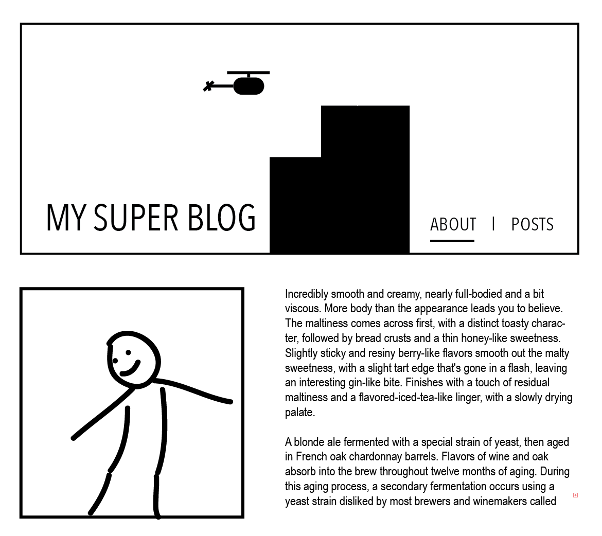
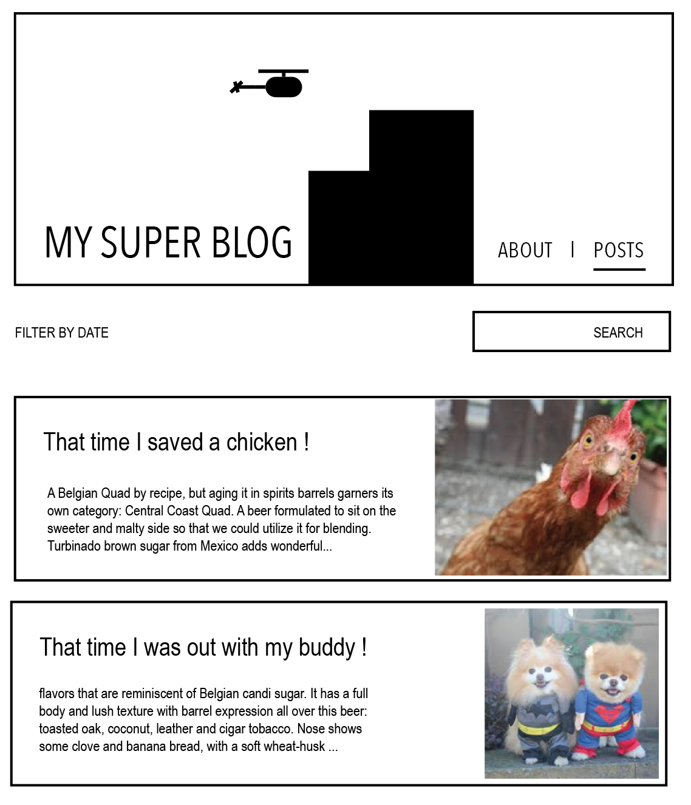

# Angular 4 Route & Pipe Challenge

Les deux façons les plus répandues de gérer le changement dynamique du contenu via Angular 4 sont les Pipes et les routes.


Les Pipes ont pour but de filtrer, organiser, arranger le contenu selon une variable, méthode.
Les Routes ont pour but d'afficher un contenu selon la route (URL) sur laquelle on se trouve.


## Instructions

- Créer un blog autour d'un sujet au choix.
- Créer deux routes About et Posts. **use**: RouterModule & Routes.
- Une qui affiche une description + image du blogueur.
- Une qui affiche un liste de posts (au moins 5). **use**: ngFor & Interface[].
- Créer un input de recherche et attacher sa valeur a une variable. **use**: ngModel.
- Créer un Pipe qui filtre les articles selon la presence ou non de cette variable dans le titre ou la description.
- Créez un filtre par date qui toggle au click du plus ancien au plus vieux ou du plus vieux au plus ancien. **use**: pipe operatior ``` | ```.
- BONUS : Utiliser ng-content pour créer vos articles.

## Résultats

**ABOUT**
---------------------------


**POSTS**
---------------------------


## Important

Pensez aux méthodologies vues :
- Organiser vos tâches par échelle de difficulté.
- Résoudre les problèmes logiques de façon basique avant de passer longtemps sur la mise en page.


